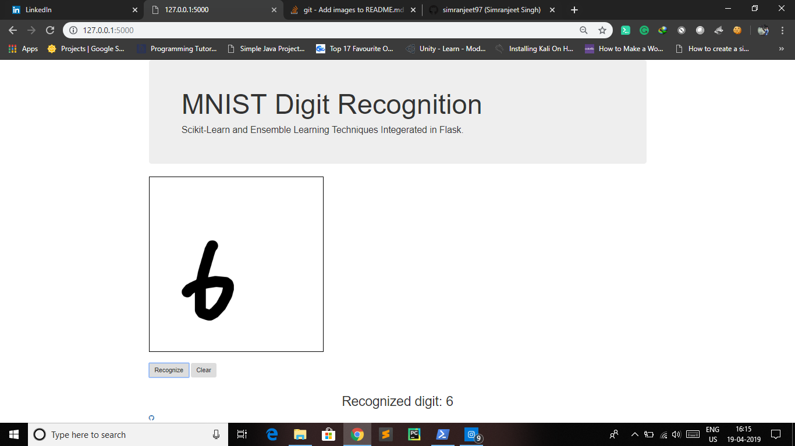

# Digit_Recognition_FlaskApp
MNIST Digit Recognition Using Scikit-Learn and Ensemble Learning and Then Make an Web-App Using Flask.

# Requirements -
1. Scikit-Learn
2. Flask
3. Scikit-Image
4. Numpy
5. Matplotlib
6. Scipy

Run the App just by Typing - " python server.py " in Command Prompt.

Author - Simranjeet Singh - Data Scientist - Freelancer
Linkedin - https://www.linkedin.com/in/simranjeet-singh-ab8071153/
